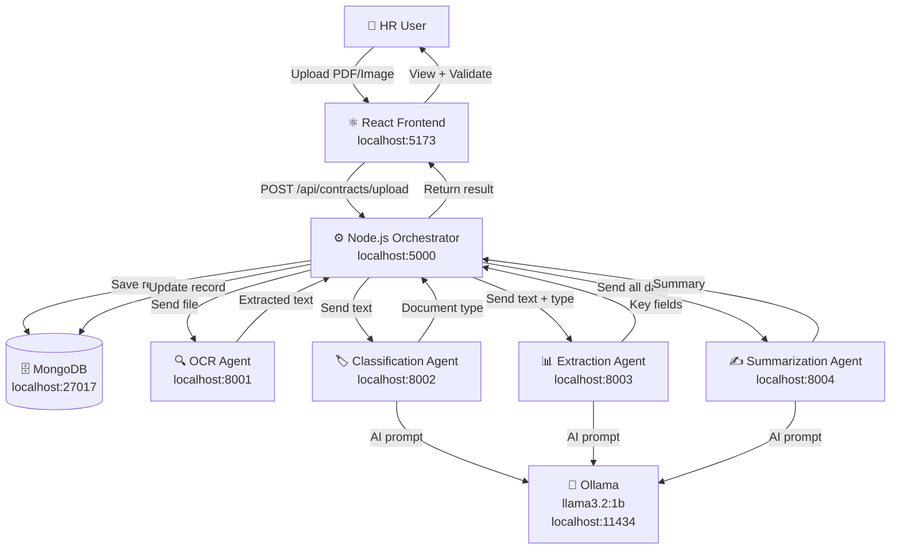
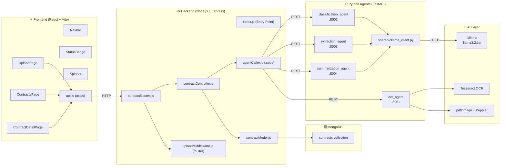
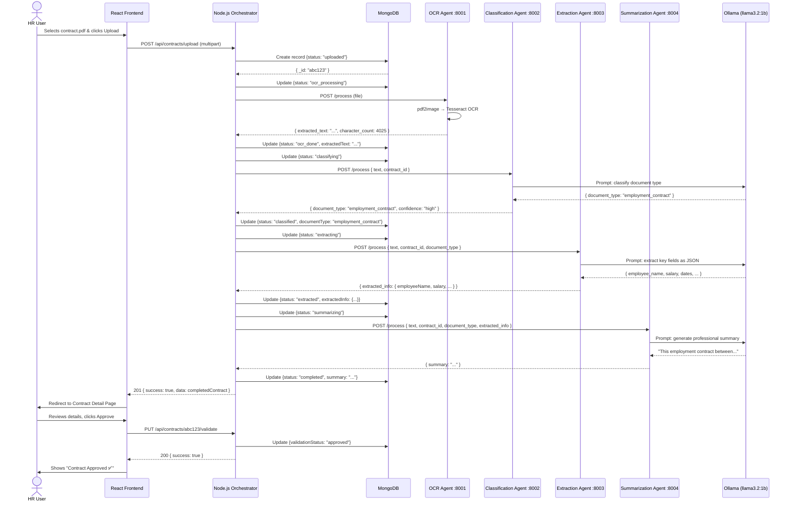

# HR Contract Pipeline — Project Documentation

> **Type:** Proof of Concept (PoC)
> **Stack:** MERN + Python Microservices + Local AI (Ollama)
> **Author:** Bass
> **Status:** PoC — Functional End-to-End

---

## Table of Contents

1. [Global Project Description](#1-global-project-description)
2. [Proof of Concept Scenario](#2-proof-of-concept-scenario)
3. [System Architecture](#3-system-architecture)
4. [Diagrams](#4-diagrams)
5. [Tech Stack](#5-tech-stack)
6. [Libraries & Dependencies](#6-libraries--dependencies)
7. [Implementation Summary](#7-implementation-summary)
8. [Challenges & Solutions](#8-challenges--solutions)
9. [Objectives Achieved](#9-objectives-achieved)
10. [Remaining Work](#10-remaining-work)
11. [Improvement Areas](#11-improvement-areas)

---

## 1. Global Project Description

### Purpose

The **HR Contract Pipeline** is an AI-powered document processing system designed to automate the handling of HR contracts. It takes a raw contract file (PDF or image), processes it through a chain of specialized AI agents, and produces structured, human-readable results — all without manual data entry.

### Problem It Solves

In most organizations, HR departments receive contracts in unstructured formats (scanned PDFs, images, Word documents). Processing these manually is:

- **Time-consuming** — reading, classifying, and extracting data by hand takes significant effort
- **Error-prone** — manual extraction of names, salaries, and dates leads to mistakes
- **Unscalable** — growing document volumes cannot be handled efficiently by manual processes

This system automates the entire pipeline: from raw file upload to structured data extraction, classification, summarization, and HR validation — reducing processing time from hours to minutes.

### Who It Is For

- **HR Departments** processing employment contracts, NDAs, freelance agreements, and other HR documents
- **Internship / PoC context:** This project was built as a proof of concept for an internship project demonstrating multi-agent AI system design
- **Developers** learning how to build multi-agent AI systems using a MERN + Python microservices architecture

### Core Value Proposition

> Upload a contract → AI reads, classifies, extracts, and summarizes it → HR validates with one click.

The system replaces manual document handling with a fully automated, locally-running AI pipeline that requires no paid external APIs.

---

## 2. Proof of Concept Scenario

### Selected Scenario: Employment Contract Processing

The PoC demonstrates the end-to-end processing of a standard **employment contract** — the most common document type in any HR department.

### Concrete Example

A sample contract was used containing:

- **Employee:** Karim Ben Salah
- **Company:** TechNova Solutions Ltd.
- **Role:** Senior Software Engineer
- **Salary:** 4,500 TND/month
- **Start Date:** February 01, 2024
- **Notice Period:** 30 days

### Why This Scenario Was Selected

- Employment contracts are **universally understood** and easy to verify
- They contain **clearly defined extractable fields** (name, salary, dates, title)
- They represent the highest-volume document type in HR workflows
- The scenario exercises **all pipeline stages** simultaneously (OCR → Classification → Extraction → Summarization)

### What the PoC Demonstrates

| Capability | Demonstrated |
|---|---|
| File upload via web UI | ✅ |
| OCR text extraction from PDF | ✅ |
| AI-based document classification | ✅ |
| Structured key-field extraction | ✅ |
| Natural language summarization | ✅ |
| HR validation workflow | ✅ |
| Persistent storage in MongoDB | ✅ |
| Multi-agent orchestration | ✅ |

---

## 3. System Architecture

### Architecture Type

The system follows a **Multi-Agent Microservices Architecture** organized into three layers:

1. **Frontend Layer** — React SPA for user interaction
2. **Orchestration Layer** — Node.js/Express server that coordinates the pipeline
3. **Agent Layer** — Four independent Python/FastAPI microservices, each responsible for one processing stage

### How Components Interact

1. The **user** uploads a contract file through the React frontend
2. The React app sends a `POST /api/contracts/upload` request (multipart form-data) to the **Node.js orchestrator**
3. The orchestrator saves the file to disk and creates a MongoDB record with `status: "uploaded"`
4. The orchestrator calls each agent **sequentially** via REST API:
   - Sends the file to the **OCR Agent** → receives extracted text
   - Sends the text to the **Classification Agent** → receives document type
   - Sends text + document type to the **Extraction Agent** → receives key fields
   - Sends all data to the **Summarization Agent** → receives a summary
5. After each agent responds, the orchestrator **updates MongoDB** with the result and advances the status
6. The final record (status: `completed`) is returned to the frontend
7. The user views results and can **approve or reject** the contract via the UI

### Agent Communication

All agents expose a REST API built with FastAPI. The Node.js orchestrator communicates with them using `axios`. Agents do not communicate with each other directly — all coordination goes through the Node.js orchestrator (hub-and-spoke pattern).

### AI Model

All three AI agents (Classification, Extraction, Summarization) use **Ollama** running locally on the machine. The model used is `llama3.2:1b` — a lightweight 1-billion parameter model chosen for its low memory footprint (~900MB RAM).

---

## 4. Diagrams

### 4.1 High-Level Architecture Diagram

### 4.2 Component Diagram

### 4.3 Sequence Diagram (PoC Flow)

---

## 5. Tech Stack

### Frontend

| Technology | Version | Why Chosen |
|---|---|---|
| React | 18.x | Industry-standard UI library; component-based architecture fits our multi-page app |
| Vite | 5.x | Faster than Create React App; instant hot reload during development |
| React Router DOM | 6.x | Client-side navigation between Upload, List, and Detail pages |
| react-dropzone | Latest | Drag-and-drop file upload UX |
| Axios | 1.x | Promise-based HTTP client; cleaner than fetch() for API calls |

### Backend

| Technology | Version | Why Chosen |
|---|---|---|
| Node.js | 20.x LTS | JavaScript runtime; pairs naturally with React frontend |
| Express | 4.x | Minimal, flexible web framework for building REST APIs |
| Mongoose | 8.x | ODM for MongoDB; provides schema validation and clean query API |
| Multer | 1.x | De-facto standard for handling file uploads in Express |
| dotenv | 16.x | Environment variable management; keeps secrets out of code |
| CORS | 2.x | Required to allow React (port 5173) to call Node.js (port 5000) |
| form-data | Latest | Enables Node.js to send multipart file data to Python agents |

### AI Agents

| Technology | Version | Why Chosen |
|---|---|---|
| Python | 3.11 | Best ecosystem for AI/ML tooling |
| FastAPI | 0.111 | Modern, fast Python web framework with automatic API docs |
| Uvicorn | 0.29 | ASGI server that runs FastAPI; supports hot reload |
| Pydantic | Built-in | Request/response validation in FastAPI |

### OCR

| Technology | Why Chosen |
|---|---|
| Tesseract OCR | Open-source, free, supports multiple languages, widely used |
| pytesseract | Python wrapper for Tesseract; simple API |
| Pillow | Image processing library required by pytesseract |
| pdf2image | Converts PDF pages to images for Tesseract to process |
| Poppler | Backend engine required by pdf2image on Windows |

### AI / NLP

| Technology | Why Chosen |
|---|---|
| Ollama | Runs LLMs locally — no API costs, no internet required, privacy-safe |
| llama3.2:1b | Lightweight (1B params, ~900MB RAM); fits in constrained memory environments |

### Database

| Technology | Why Chosen |
|---|---|
| MongoDB | Document-oriented; stores contract records as flexible JSON; no rigid schema needed |
| MongoDB Compass | GUI for inspecting database contents during development |

---

## 6. Libraries & Dependencies

### Node.js (server/package.json)

| Package | Role |
|---|---|
| `express` | Web server and routing framework |
| `mongoose` | MongoDB object modeling — defines the Contract schema |
| `multer` | Parses multipart/form-data for file uploads; saves files to `uploads/` |
| `dotenv` | Loads `.env` variables into `process.env` |
| `cors` | Sets CORS headers to allow cross-origin requests from React |
| `axios` | Makes HTTP requests from Node.js to Python agents |
| `form-data` | Constructs multipart form payloads to forward files to OCR agent |
| `nodemon` *(dev)* | Auto-restarts Node.js server on file save |

### Python — OCR Agent (ocr_agent/requirements.txt)

| Package | Role |
|---|---|
| `fastapi` | Web framework providing `/health` and `/process` endpoints |
| `uvicorn` | ASGI server that serves the FastAPI app |
| `pytesseract` | Python wrapper for the Tesseract OCR engine |
| `Pillow` | Opens and pre-processes image files for OCR |
| `pdf2image` | Converts each PDF page into a PIL Image for OCR processing |
| `python-multipart` | Enables FastAPI to receive uploaded binary files |

### Python — Classification / Extraction / Summarization Agents

| Package | Role |
|---|---|
| `fastapi` | REST API framework |
| `uvicorn` | ASGI server |
| `requests` | Makes HTTP calls to the Ollama API |
| `python-multipart` | Handles incoming request bodies |

### Shared Python Utility (agents/shared/ollama_client.py)

| Function | Role |
|---|---|
| `ask_ollama(prompt, system_prompt)` | Sends a prompt to the local Ollama model and returns the text response |
| `check_ollama_health()` | Verifies Ollama is running and the model is available |

---

## 7. Implementation Summary

The project was built in 8 sequential phases:

### Phase 1 — Environment Setup
- Installed Node.js, Python 3.11, MongoDB, Tesseract OCR, Ollama, Git, VS Code
- Downloaded the `llama3.2:1b` model via Ollama (switched from `llama3.2` due to RAM constraints)
- Configured system PATH for Tesseract and Poppler on Windows

### Phase 2 — Project Structure
- Created the full monorepo folder layout: `client/`, `server/`, `agents/`
- Created all placeholder files and subfolders
- Initialized a Git repository with `.gitignore` configured for Node, Python, and uploads
- Made the first commit establishing the project skeleton

### Phase 3 — Node.js Backend
- Initialized the Express server with `express`, `mongoose`, `multer`, `cors`, `dotenv`
- Defined the `Contract` Mongoose schema with fields for status tracking, extracted text, classification, key info, summary, and validation
- Built the upload middleware (multer) with file type filtering and size limits (10MB)
- Implemented 4 controller functions: `uploadContract`, `getAllContracts`, `getContractById`, `validateContract`
- Connected to MongoDB and started the server on port 5000
- Verified with the `/health` endpoint

### Phase 4 — Python Agents Setup
- Created 4 isolated Python virtual environments (one per agent)
- Wrote `requirements.txt` for each agent
- Implemented FastAPI skeletons with `/health` and `/process` endpoints for all 4 agents
- Wrote the shared `ollama_client.py` utility with `ask_ollama()` and `check_ollama_health()`
- Verified all 4 agents start correctly on ports 8001–8004

### Phase 5 — OCR Implementation
- Installed Poppler on Windows and added it to the system PATH
- Rewrote the OCR agent with full Tesseract integration:
  - PDF files: converted page-by-page to images using `pdf2image`, then OCR'd each page
  - Image files: opened directly with Pillow and OCR'd
  - Output: cleaned text with page separators
- Updated Node.js controller to call the OCR agent using `form-data` and `axios`
- Added `form-data` package to Node.js
- Verified end-to-end: upload → OCR → MongoDB update with `status: "ocr_done"`

### Phase 6 — AI Agents (Classification, Extraction, Summarization)
- **Classification Agent:** Prompts Ollama to classify the document into one of 7 categories (employment_contract, nda, freelance_agreement, etc.). Includes a keyword-based fallback if JSON parsing fails.
- **Extraction Agent:** Prompts Ollama to return a structured JSON object with 9 fields (employee name, company, salary, dates, etc.). Includes a regex-based fallback for salary and date patterns.
- **Summarization Agent:** Prompts Ollama to write a 2–3 paragraph professional summary using extracted data as context.
- Updated the Node.js orchestrator to call all 4 agents sequentially, updating MongoDB status at each stage
- Switched from `llama3.2` to `llama3.2:1b` to fit within available system RAM (2.1 GiB free)

### Phase 7 — React Frontend
- Scaffolded the app with Vite (JavaScript template)
- Created `api.js` centralizing all Axios calls
- Built reusable components: `Navbar`, `StatusBadge`, `Spinner`
- Built 3 pages:
  - **UploadPage:** Drag-and-drop file selector with progress bar and pipeline stage messages
  - **ContractsPage:** List of all contracts with status badges and click-to-view
  - **ContractDetailPage:** Full contract view with extracted info, AI summary, and approve/reject validation
- Configured React Router for client-side navigation

### Phase 8 — Developer Experience
- Created `start.ps1`: one-click PowerShell script that starts all 7 services (MongoDB, Ollama, 4 agents, Node.js, React) in separate windows
- Created `stop.ps1`: kills all running services and stops MongoDB

---

## 8. Challenges & Solutions

| # | Challenge | Root Cause | Solution Applied |
|---|---|---|---|
| 1 | `touch` command not found on Windows | `touch` is a Linux/Mac command not available in PowerShell | Used `New-Item -ItemType File` as the Windows equivalent |
| 2 | `npm init -y` failed with JSON parse error | `package.json` was created as an empty file in Phase 2 | Deleted the empty file with `Remove-Item`, then re-ran `npm init -y` |
| 3 | PowerShell `-Form` flag not recognized | `-Form` parameter only exists in PowerShell 7+; older versions don't support it | Switched to Postman for API testing; provided manual PowerShell workaround |
| 4 | `git add` failed with "dubious ownership" | Project folder was created by Windows Administrator account, not the current user | Ran `git config --global --add safe.directory` as suggested by Git's error message |
| 5 | Postman stuck on "Sending request..." with no response | None of the services were running | Started all services in correct order; educated on the need to keep terminal windows open |
| 6 | `netstat` filter with `\|` not working in PowerShell | PowerShell's `findstr` doesn't support `\|` as OR operator | Ran separate `findstr` calls for each port individually |
| 7 | Ollama `500 Internal Server Error` | The `llama3.2` (3B) model required 2.3 GiB RAM but only 2.1 GiB was available | Switched to `llama3.2:1b` (1B params, ~900MB RAM); updated `MODEL_NAME` in `ollama_client.py` |
| 8 | `ollama serve` error: address already in use | Ollama auto-starts on Windows at boot; running it again caused a port conflict | Recognized Ollama was already running; skipped manual start |
| 9 | `net start MongoDB` — "Access is denied" | Starting Windows services requires Administrator privileges | Re-opened PowerShell as Administrator; configured MongoDB to auto-start on boot |
| 10 | `tslib` import error in Vite for react-dropzone | Missing peer dependency `tslib` not bundled with react-dropzone | Ran `npm install tslib` and cleared Vite's cache (`node_modules/.vite`) |
| 11 | ESLint `no-unused-vars` errors in React | Variables `error` and `err` were declared in catch blocks but never used in JSX | Renamed to `_error`/`_err` (ESLint convention); used optional catch binding `catch { }` for ES2019+ |
| 12 | "Agent at localhost:8001 is not running" from frontend | Python agents were not started before testing the upload | Created `start.ps1` script to launch all services with a single command |

---

## 9. Objectives Achieved

- ✅ **Multi-agent architecture** implemented with 4 independent Python microservices
- ✅ **OCR pipeline** — extracts text from both PDF and image files using Tesseract
- ✅ **AI classification** — identifies document type using a local LLM (Ollama)
- ✅ **AI extraction** — pulls structured key fields (name, salary, dates, title, company) from contract text
- ✅ **AI summarization** — generates a professional 2–3 paragraph summary
- ✅ **Orchestration** — Node.js coordinates the full pipeline with status tracking at every step
- ✅ **Persistent storage** — all data stored in MongoDB with full audit trail (status history via timestamps)
- ✅ **REST API** — clean, documented endpoints for upload, list, detail, and validation
- ✅ **React frontend** — functional UI with file upload, contract list, detail view, and HR validation
- ✅ **HR validation workflow** — approve/reject with optional notes
- ✅ **Error handling** — fallback mechanisms (keyword classification, regex extraction) when AI returns unexpected output
- ✅ **100% free/local** — no paid APIs; everything runs on the developer's machine
- ✅ **One-click startup** — `start.ps1` launches all 7 services automatically

---

## 10. Remaining Work

### Not Yet Implemented

- **Authentication & Authorization** — no login system; any user can upload and validate contracts
- **Real-time status updates** — the frontend does not auto-refresh during processing (user must wait for the full pipeline to complete before seeing results); no WebSocket or polling implementation
- **File format support** — `.doc` and `.docx` Word documents are not supported; only PDF and images
- **Multi-language OCR** — Tesseract is configured for English & French only (`lang='eng,fra'`); Arabic and other languages not supported
- **Agent health check before pipeline** — the orchestrator does not verify that all agents are running before starting; if one agent is down mid-pipeline, the contract is marked as `failed`
- **File deletion** — uploaded files in `server/uploads/` are never cleaned up
- **Pagination** — the contracts list fetches all records with no pagination
- **Unit and integration tests** — no automated test suite exists for any component
- **Docker / containerization** — services must be started manually; no Docker Compose setup

---

## 11. Improvement Areas

### Technical Improvements

| Area | Current State | Recommended Improvement |
|---|---|---|
| **Pipeline execution** | Sequential (each agent waits for the previous) | Parallelize independent steps where possible |
| **Memory usage** | `llama3.2:1b` used due to RAM constraint | Deploy on a machine with ≥8GB free RAM to use larger models (llama3.2:3b or mistral) |
| **Agent resilience** | Single retry attempt; marks as `failed` on any error | Add exponential backoff retry logic in `agentCaller.js` |
| **Security** | No authentication; no file validation beyond extension | Add JWT authentication, MIME type verification, and virus scanning |
| **File storage** | Local disk (`server/uploads/`) | Move to object storage (e.g., MinIO locally, or S3-compatible) |
| **Environment** | All services run locally on one machine | Containerize with Docker Compose for reproducible deployment |
| **OCR quality** | Basic Tesseract with default settings | Pre-process images (deskew, denoise, increase contrast) before OCR for better accuracy |
| **AI prompts** | Simple prompts without few-shot examples | Add few-shot examples to prompts for more consistent structured output |
| **Error recovery** | Failed contracts cannot be reprocessed | Add a "Retry Processing" button on the detail page |

### Product / UX Improvements

- **Real-time progress** — implement WebSocket or Server-Sent Events (SSE) to push live pipeline status to the frontend instead of waiting for completion
- **Bulk upload** — allow HR to upload multiple contracts at once
- **Search & filter** — add filtering by status, document type, date, and employee name on the contracts list page
- **Export** — allow exporting contract data as CSV or PDF report
- **Notifications** — email or in-app notification when processing completes
- **Dashboard** — summary statistics (total contracts, approval rate, average processing time)
- **Edit extracted fields** — allow HR users to manually correct AI extraction errors before approving

### Future Enhancements

- **Multi-language support** — add Tesseract language packs and multilingual Ollama models
- **Signature detection** — use computer vision to detect whether a contract has been physically signed
- **Clause extraction** — identify and tag specific legal clauses (termination, confidentiality, non-compete)
- **Anomaly detection** — flag contracts with unusual salary ranges or missing mandatory fields
- **Version control for contracts** — track amendments and changes to the same contract over time
- **Integration** — connect to Elise GED system

---

*Documentation generated based on the actual implementation completed across Phases 1–8.*
*All features described reflect what was built and verified during development.*
